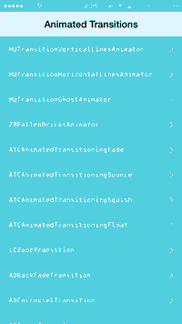

AnimatedTransitionGallery
=========================

Collection of iOS 7 custom animated transitions using UIViewControllerAnimatedTransitioning protocol.




##How to build

````
$ git clone https://github.com/shu223/AnimatedTransitionGallery
$ cd AnimatedTransitionGallery/
$ git submodule update --init --recursive
````

##Available Transitions

- HUTransitionVerticalLinesAnimator
- HUTransitionHorizontalLinesAnimator
- HUTransitionGhostAnimator
- ZBFallenBricksAnimator
- ATCAnimatedTransitioningFade
- ATCAnimatedTransitioningBounce
- ATCAnimatedTransitioningSquish
- ATCAnimatedTransitioningFloat
- LCZoomTransition
- ADBackFadeTransition
- ADCarrouselTransition
- ADCrossTransition
- ADCubeTransition
- ADFadeTransition
- ADFlipTransition
- ADFoldTransition
- ADGhostTransition
- ADGlueTransition
- ADModernPushTransition
- ADPushRotateTransition
- ADScaleTransition
- ADSlideTransition
- ADSwapTransition
- ADSwipeFadeTransition
- ADSwipeTransition
- ADZoomTransition
- CECardsAnimationController
- CECrossfadeAnimationController
- CECubeAnimationController
- CEExplodeAnimationController
- CEFlipAnimationController
- CEFoldAnimationController
- CENatGeoAnimationController
- CEPortalAnimationController
- CETurnAnimationController
- KWTransitionStyleNameRotateFromTop
- KWTransitionStyleNameFadeBackOver
- KWTransitionStyleNameBounceIn
- KWTransitionStyleNameDropOut
- KWTransitionStyleNameStepBackScroll
- KWTransitionStyleNameStepBackSwipe
- KWTransitionStyleNameUp
- KWTransitionStyleNamePushUp
- KWTransitionStyleNameFall
- KWTransitionStyleNameSink
- DMAlphaTransition
- DMScaleTransition
- DMSlideTransition
- HFAnimator
- HFDynamicAnimator
- BouncePresentTransition
- FlipTransition
- ShrinkDismissTransition

##Related Article

- [http://d.hatena.ne.jp/shu223/20140416/1397608824](http://d.hatena.ne.jp/shu223/20140416/1397608824)  (Japanese)
