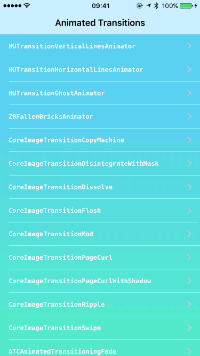
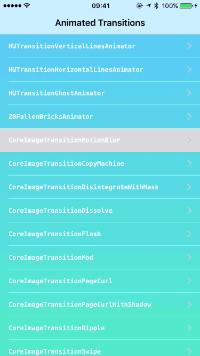
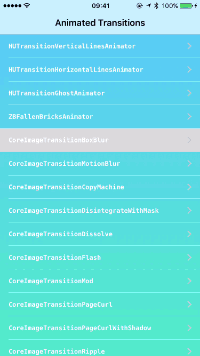

AnimatedTransitionGallery
=========================

[](https://developer.apple.com/iphone/index.action)
[](http://mit-license.org)
[](http://twitter.com/shu223)


Collection of custom animated transitions for iOS using `UIViewControllerAnimatedTransitioning` protocol.








##How to build

````
$ git clone https://github.com/shu223/AnimatedTransitionGallery
$ cd AnimatedTransitionGallery/
$ git submodule update --init --recursive
````

##Available Transitions

- HUTransitionVerticalLinesAnimator
- HUTransitionHorizontalLinesAnimator
- HUTransitionGhostAnimator
- ZBFallenBricksAnimator
- CoreImageTransitionBoxBlur
- CoreImageTransitionMotionBlur
- CoreImageTransitionCopyMachine
- CoreImageTransitionDisintegrateWithMask
- CoreImageTransitionDissolve
- CoreImageTransitionFlash
- CoreImageTransitionMod
- CoreImageTransitionPageCurl
- CoreImageTransitionPageCurlWithShadow
- CoreImageTransitionRipple
- CoreImageTransitionSwipe
- ATCAnimatedTransitioningFade
- ATCAnimatedTransitioningBounce
- ATCAnimatedTransitioningSquish
- ATCAnimatedTransitioningFloat
- LCZoomTransition
- ADBackFadeTransition
- ADCarrouselTransition
- ADCrossTransition
- ADCubeTransition
- ADFadeTransition
- ADFlipTransition
- ADFoldTransition
- ADGhostTransition
- ADGlueTransition
- ADModernPushTransition
- ADPushRotateTransition
- ADScaleTransition
- ADSlideTransition
- ADSwapTransition
- ADSwipeFadeTransition
- ADSwipeTransition
- ADZoomTransition
- CECardsAnimationController
- CECrossfadeAnimationController
- CECubeAnimationController
- CEExplodeAnimationController
- CEFlipAnimationController
- CEFoldAnimationController
- CENatGeoAnimationController
- CEPortalAnimationController
- CETurnAnimationController
- KWTransitionStyleNameRotateFromTop
- KWTransitionStyleNameFadeBackOver
- KWTransitionStyleNameBounceIn
- KWTransitionStyleNameDropOut
- KWTransitionStyleNameStepBackScroll
- KWTransitionStyleNameStepBackSwipe
- KWTransitionStyleNameUp
- KWTransitionStyleNamePushUp
- KWTransitionStyleNameFall
- KWTransitionStyleNameSink
- DMAlphaTransition
- DMScaleTransition
- DMSlideTransition
- HFAnimator
- HFDynamicAnimator
- BouncePresentTransition
- FlipTransition
- ShrinkDismissTransition

##Author

**Shuichi Tsutsumi**

iOS freelancer in Japan. Welcome works from abroad!

- PAST WORKS:  [My Profile Summary](https://medium.com/@shu223/my-profile-summary-f14bfc1e7099#.vdh0i7clr)
- PROFILES: [LinkedIn](https://www.linkedin.com/profile/view?id=214896557)
- BLOGS: [English](https://medium.com/@shu223/) / [Japanese](http://d.hatena.ne.jp/shu223/)
- CONTACTS: [Twitter](https://twitter.com/shu223) / [Facebook](https://www.facebook.com/shuichi.tsutsumi)
